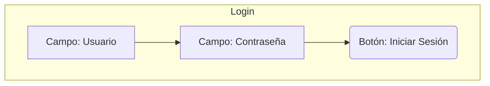
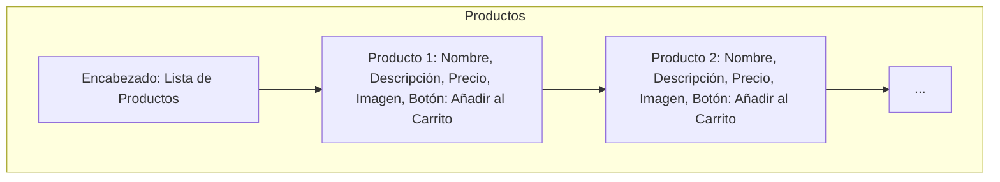
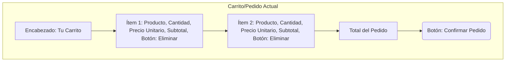
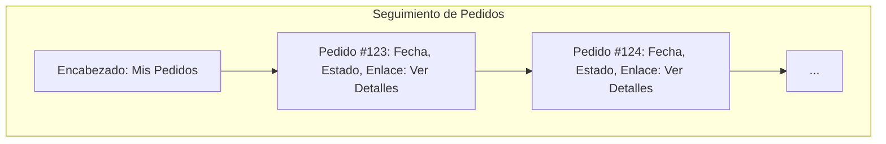
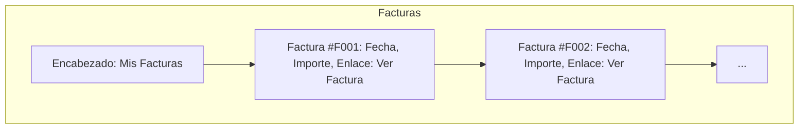
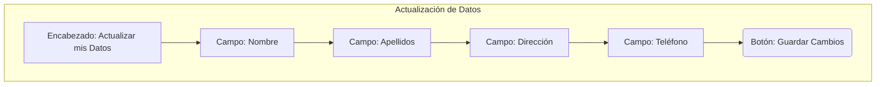
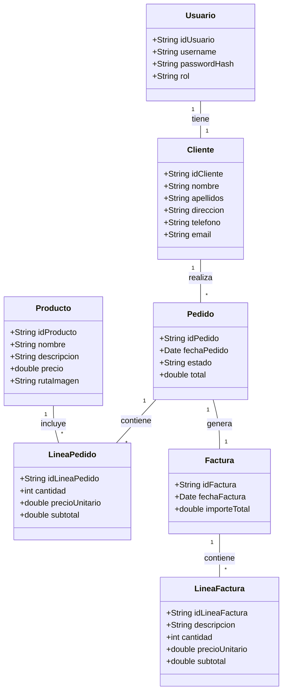

# Diseño de la Aplicación y Arquitectura del Sistema

## 1. Arquitectura General

La aplicación seguirá una arquitectura cliente-servidor, donde el cliente será una aplicación web accesible a través de un navegador y el servidor manejará la lógica de negocio y la interacción con la base de datos. Se propone una arquitectura de tres capas:

*   **Capa de Presentación (Frontend):** Responsable de la interfaz de usuario y la interacción con el usuario. Se desarrollará utilizando tecnologías web estándar (HTML, CSS, JavaScript).
*   **Capa de Lógica de Negocio (Backend):** Contendrá la lógica central de la aplicación, gestionará las solicitudes del cliente, procesará los datos y se comunicará con la capa de datos. Se puede implementar en un lenguaje como Java.
*   **Capa de Datos:** Encargada del almacenamiento y recuperación de la información. Se utilizará una base de datos relacional como MySQL.

## 2. Diagrama de Arquitectura

```mermaid
graph TD
    A[Usuario] --> B(Navegador Web)
    B --> C{Servidor de Aplicaciones}
    C --> D[Capa de Lógica de Negocio]
    D --> E[Capa de Datos (MySQL)]
    E --> F[Sistema de Archivos (Imágenes)]
    D --> F
```

## 3. Diseño de la Interfaz de Usuario (Mockups)

A continuación, se presentan los mockups de las principales pantallas de la aplicación. Estos mockups son representaciones visuales simplificadas de la interfaz de usuario y sirven para ilustrar la disposición de los elementos y la interacción.

### 3.1. Página de Login

Esta será la primera pantalla que verá el usuario. Contendrá campos para el nombre de usuario y la contraseña, y un botón para iniciar sesión. También podría incluir un enlace para recuperar la contraseña o registrarse (aunque el registro no es parte del alcance inicial).



### 3.2. Página de Productos

Mostrará un listado de productos disponibles, con su nombre, descripción, precio y una imagen. Cada producto tendrá un botón para añadirlo al carrito de compras.



### 3.3. Página de Carrito/Pedido Actual

En esta página, el usuario podrá ver los productos que ha añadido a su carrito, la cantidad de cada uno, el precio unitario y el total. Podrá modificar las cantidades o eliminar productos. Habrá un botón para confirmar el pedido.



### 3.4. Página de Seguimiento de Pedidos

Aquí el usuario podrá consultar el estado de sus pedidos anteriores (creado, en transporte, entregado). Se mostrará un listado de pedidos con su ID, fecha, estado y un enlace para ver los detalles del pedido.



### 3.5. Página de Facturas

Esta página mostrará un listado de las facturas generadas para el usuario, con su número de factura, fecha, importe total y un enlace para ver o descargar la factura completa.



### 3.6. Página de Actualización de Datos del Cliente

Un formulario donde el cliente podrá ver y modificar su información personal, como nombre, dirección, teléfono, etc. Habrá un botón para guardar los cambios.



## 4. Diseño de Clases (Orientación a Objetos)

Se propone el siguiente diseño de clases para la lógica de negocio. Estas clases representarán las entidades principales y sus relaciones, facilitando la implementación y el mantenimiento del código.



## 5. Seguridad

La seguridad se abordará en varios niveles:

*   **Autenticación:** Se implementará un sistema de autenticación robusto con almacenamiento seguro de contraseñas (hashing y salting).
*   **Autorización:** Una vez autenticado, el sistema verificará los permisos del usuario para acceder a ciertas funcionalidades o datos.
*   **Validación de Entrada:** Todas las entradas de usuario serán validadas para prevenir ataques como inyección SQL o Cross-Site Scripting (XSS).
*   **Comunicación Segura:** Se recomienda el uso de HTTPS para cifrar la comunicación entre el cliente y el servidor.

## 6. Idiomas

La aplicación se desarrollará inicialmente en español. La arquitectura permitirá una futura expansión a otros idiomas mediante la externalización de cadenas de texto y el uso de un sistema de internacionalización (i18n).

## 7. Plan del Proyecto (Detalle de Fases)

Las fases del proyecto, ya mencionadas en el análisis, se detallarán en términos de tareas específicas y entregables para cada una:

1.  **Análisis de requisitos y definición del proyecto:**
    *   Recopilación y análisis de requisitos.
    *   Definición del alcance y funcionalidades.
    *   Elaboración del documento de análisis (ya completado).

2.  **Diseño de la aplicación y arquitectura del sistema:**
    *   Diseño de la arquitectura general.
    *   Creación de mockups de la interfaz de usuario.
    *   Definición del diseño de clases.
    *   Elaboración del documento de diseño (este documento).

3.  **Diseño de la base de datos:**
    *   Diseño del esquema de la base de datos (tablas, campos, relaciones).
    *   Normalización de la base de datos.
    *   Generación del script SQL para la creación de la base de datos.
    *   Elaboración del documento de diseño de la base de datos.

4.  **Desarrollo de la aplicación:**
    *   Implementación de la capa de datos (DAO/repositorios).
    *   Implementación de la lógica de negocio.
    *   Desarrollo de la interfaz de usuario (páginas y formularios).
    *   Integración de las capas.
    *   Pruebas unitarias y de integración.

5.  **Documentación técnica y manual de usuario:**
    *   Elaboración de la documentación técnica detallada del código.
    *   Creación del manual de usuario con instrucciones de uso.

6.  **Entrega de resultados al usuario:**
    *   Entrega de todos los documentos, código fuente y script de la base de datos.
    *   Presentación de la aplicación.


