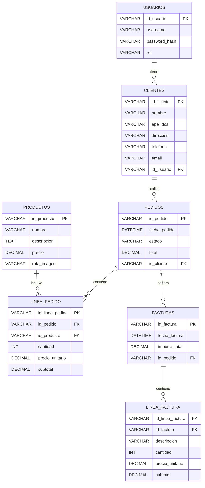

# Diseño de la Base de Datos

## 1. Introducción

Este documento detalla el diseño de la base de datos para la aplicación de gestión de pedidos y facturación. Se ha optado por un sistema de gestión de bases de datos relacional (RDBMS), específicamente MySQL, debido a su robustez, escalabilidad y amplia adopción en el mercado. El diseño se enfoca en la normalización para asegurar la integridad de los datos, minimizar la redundancia y optimizar el rendimiento de las consultas.

## 2. Modelo Entidad-Relación (MER)

El siguiente diagrama de entidad-relación (MER) representa las entidades principales de la aplicación y las relaciones entre ellas. Este modelo sirve como base para la creación del esquema de la base de datos.



## 3. Descripción de Tablas y Campos

A continuación, se describe cada una de las tablas, sus campos, tipos de datos y restricciones.

### 3.1. Tabla `USUARIOS`

Almacena la información de los usuarios que pueden acceder a la aplicación.

| Campo           | Tipo de Dato    | Restricciones        | Descripción                               |
| :-------------- | :-------------- | :------------------- | :---------------------------------------- |
| `id_usuario`    | `VARCHAR(36)`   | `PRIMARY KEY`        | Identificador único del usuario (UUID).   |
| `username`      | `VARCHAR(50)`   | `NOT NULL`, `UNIQUE` | Nombre de usuario para el login.          |
| `password_hash` | `VARCHAR(255)`  | `NOT NULL`           | Hash seguro de la contraseña del usuario. |
| `rol`           | `VARCHAR(20)`   | `NOT NULL`           | Rol del usuario (ej. 'cliente', 'admin'). |

### 3.2. Tabla `CLIENTES`

Contiene la información detallada de los clientes de la tienda.

| Campo         | Tipo de Dato    | Restricciones        | Descripción                               |
| :------------ | :-------------- | :------------------- | :---------------------------------------- |\n| `id_cliente`  | `VARCHAR(36)`   | `PRIMARY KEY`        | Identificador único del cliente (UUID).   |
| `nombre`      | `VARCHAR(100)`  | `NOT NULL`           | Nombre del cliente.                       |
| `apellidos`   | `VARCHAR(100)`  | `NOT NULL`           | Apellidos del cliente.                    |
| `direccion`   | `VARCHAR(255)`  | `NOT NULL`           | Dirección de envío/facturación.           |
| `telefono`    | `VARCHAR(20)`   | `NULLABLE`           | Número de teléfono del cliente.           |
| `email`       | `VARCHAR(100)`  | `NOT NULL`, `UNIQUE` | Correo electrónico del cliente.           |
| `id_usuario`  | `VARCHAR(36)`   | `FOREIGN KEY`        | Clave foránea a `USUARIOS`.               |

### 3.3. Tabla `PRODUCTOS`

Almacena los detalles de los productos disponibles en la tienda.

| Campo         | Tipo de Dato    | Restricciones        | Descripción                               |
| :------------ | :-------------- | :------------------- | :---------------------------------------- |
| `id_producto` | `VARCHAR(36)`   | `PRIMARY KEY`        | Identificador único del producto (UUID).  |
| `nombre`      | `VARCHAR(255)`  | `NOT NULL`, `UNIQUE` | Nombre del producto.                      |
| `descripcion` | `TEXT`          | `NULLABLE`           | Descripción detallada del producto.       |
| `precio`      | `DECIMAL(10, 2)`| `NOT NULL`, `> 0`    | Precio unitario del producto.             |
| `ruta_imagen` | `VARCHAR(255)`  | `NULLABLE`           | Ruta del archivo de imagen del producto.  |

### 3.4. Tabla `PEDIDOS`

Registra los pedidos realizados por los clientes.

| Campo         | Tipo de Dato    | Restricciones        | Descripción                               |
| :------------ | :-------------- | :------------------- | :---------------------------------------- |
| `id_pedido`   | `VARCHAR(36)`   | `PRIMARY KEY`        | Identificador único del pedido (UUID).    |
| `fecha_pedido`| `DATETIME`      | `NOT NULL`           | Fecha y hora en que se realizó el pedido. |
| `estado`      | `VARCHAR(50)`   | `NOT NULL`           | Estado actual del pedido (ej. 'creado', 'en transporte', 'entregado'). |
| `total`       | `DECIMAL(10, 2)`| `NOT NULL`, `>= 0`   | Importe total del pedido.                 |
| `id_cliente`  | `VARCHAR(36)`   | `FOREIGN KEY`        | Clave foránea a `CLIENTES`.               |

### 3.5. Tabla `LINEA_PEDIDO`

Detalla los productos incluidos en cada pedido.

| Campo             | Tipo de Dato    | Restricciones        | Descripción                               |
| :---------------- | :-------------- | :------------------- | :---------------------------------------- |
| `id_linea_pedido` | `VARCHAR(36)`   | `PRIMARY KEY`        | Identificador único de la línea de pedido (UUID). |
| `id_pedido`       | `VARCHAR(36)`   | `FOREIGN KEY`        | Clave foránea a `PEDIDOS`.                |
| `id_producto`     | `VARCHAR(36)`   | `FOREIGN KEY`        | Clave foránea a `PRODUCTOS`.              |
| `cantidad`        | `INT`           | `NOT NULL`, `> 0`    | Cantidad del producto en esta línea.      |
| `precio_unitario` | `DECIMAL(10, 2)`| `NOT NULL`, `> 0`    | Precio unitario del producto en el momento del pedido. |
| `subtotal`        | `DECIMAL(10, 2)`| `NOT NULL`, `>= 0`   | Subtotal de la línea (`cantidad * precio_unitario`). |

### 3.6. Tabla `FACTURAS`

Almacena la información de las facturas generadas.

| Campo           | Tipo de Dato    | Restricciones        | Descripción                               |
| :-------------- | :-------------- | :------------------- | :---------------------------------------- |
| `id_factura`    | `VARCHAR(36)`   | `PRIMARY KEY`        | Identificador único de la factura (UUID). |
| `fecha_factura` | `DATETIME`      | `NOT NULL`           | Fecha y hora de emisión de la factura.    |
| `importe_total` | `DECIMAL(10, 2)`| `NOT NULL`, `>= 0`   | Importe total de la factura.              |
| `id_pedido`     | `VARCHAR(36)`   | `FOREIGN KEY`, `UNIQUE` | Clave foránea a `PEDIDOS`. Una factura por pedido. |

### 3.7. Tabla `LINEA_FACTURA`

Detalla los ítems incluidos en cada factura.

| Campo             | Tipo de Dato    | Restricciones        | Descripción                               |
| :---------------- | :-------------- | :------------------- | :---------------------------------------- |
| `id_linea_factura`| `VARCHAR(36)`   | `PRIMARY KEY`        | Identificador único de la línea de factura (UUID). |
| `id_factura`      | `VARCHAR(36)`   | `FOREIGN KEY`        | Clave foránea a `FACTURAS`.               |
| `descripcion`     | `VARCHAR(255)`  | `NOT NULL`           | Descripción del ítem facturado.           |
| `cantidad`        | `INT`           | `NOT NULL`, `> 0`    | Cantidad del ítem.                        |
| `precio_unitario` | `DECIMAL(10, 2)`| `NOT NULL`, `> 0`    | Precio unitario del ítem.                 |
| `subtotal`        | `DECIMAL(10, 2)`| `NOT NULL`, `>= 0`   | Subtotal de la línea (`cantidad * precio_unitario`). |

## 4. Relaciones entre Tablas

Las relaciones entre las tablas se establecen mediante claves foráneas, asegurando la integridad referencial.

*   **`USUARIOS` a `CLIENTES` (Uno a Uno):** Un usuario puede estar asociado a un único cliente. Esto permite que un usuario autenticado tenga un perfil de cliente. (`CLIENTES.id_usuario` referencia `USUARIOS.id_usuario`).
*   **`CLIENTES` a `PEDIDOS` (Uno a Muchos):** Un cliente puede realizar múltiples pedidos. (`PEDIDOS.id_cliente` referencia `CLIENTES.id_cliente`).
*   **`PEDIDOS` a `LINEA_PEDIDO` (Uno a Muchos):** Un pedido puede contener múltiples líneas de pedido. (`LINEA_PEDIDO.id_pedido` referencia `PEDIDOS.id_pedido`).
*   **`PRODUCTOS` a `LINEA_PEDIDO` (Uno a Muchos):** Un producto puede aparecer en múltiples líneas de pedido. (`LINEA_PEDIDO.id_producto` referencia `PRODUCTOS.id_producto`).
*   **`PEDIDOS` a `FACTURAS` (Uno a Uno):** Un pedido genera una única factura. (`FACTURAS.id_pedido` referencia `PEDIDOS.id_pedido`).
*   **`FACTURAS` a `LINEA_FACTURA` (Uno a Muchos):** Una factura puede contener múltiples líneas de factura. (`LINEA_FACTURA.id_factura` referencia `FACTURAS.id_factura`).

## 5. Script SQL para Creación de la Base de Datos

Se generará un script SQL (`schema.sql`) que contendrá las sentencias `CREATE TABLE` para todas las tablas, incluyendo la definición de claves primarias, claves foráneas e índices. Este script permitirá recrear la estructura de la base de datos fácilmente.

```sql
-- Ejemplo de estructura (el script completo se generará en la fase de desarrollo)

CREATE TABLE USUARIOS (
    id_usuario VARCHAR(36) PRIMARY KEY,
    username VARCHAR(50) NOT NULL UNIQUE,
    password_hash VARCHAR(255) NOT NULL,
    rol VARCHAR(20) NOT NULL
);

CREATE TABLE CLIENTES (
    id_cliente VARCHAR(36) PRIMARY KEY,
    nombre VARCHAR(100) NOT NULL,
    apellidos VARCHAR(100) NOT NULL,
    direccion VARCHAR(255) NOT NULL,
    telefono VARCHAR(20),
    email VARCHAR(100) NOT NULL UNIQUE,
    id_usuario VARCHAR(36),
    FOREIGN KEY (id_usuario) REFERENCES USUARIOS(id_usuario)
);

CREATE TABLE PRODUCTOS (
    id_producto VARCHAR(36) PRIMARY KEY,
    nombre VARCHAR(255) NOT NULL UNIQUE,
    descripcion TEXT,
    precio DECIMAL(10, 2) NOT NULL CHECK (precio > 0),
    ruta_imagen VARCHAR(255)
);

CREATE TABLE PEDIDOS (
    id_pedido VARCHAR(36) PRIMARY KEY,
    fecha_pedido DATETIME NOT NULL,
    estado VARCHAR(50) NOT NULL,
    total DECIMAL(10, 2) NOT NULL CHECK (total >= 0),
    id_cliente VARCHAR(36),
    FOREIGN KEY (id_cliente) REFERENCES CLIENTES(id_cliente)
);

CREATE TABLE LINEA_PEDIDO (
    id_linea_pedido VARCHAR(36) PRIMARY KEY,
    id_pedido VARCHAR(36),
    id_producto VARCHAR(36),
    cantidad INT NOT NULL CHECK (cantidad > 0),
    precio_unitario DECIMAL(10, 2) NOT NULL CHECK (precio_unitario > 0),
    subtotal DECIMAL(10, 2) NOT NULL CHECK (subtotal >= 0),
    FOREIGN KEY (id_pedido) REFERENCES PEDIDOS(id_pedido),
    FOREIGN KEY (id_producto) REFERENCES PRODUCTOS(id_producto)
);

CREATE TABLE FACTURAS (
    id_factura VARCHAR(36) PRIMARY KEY,
    fecha_factura DATETIME NOT NULL,
    importe_total DECIMAL(10, 2) NOT NULL CHECK (importe_total >= 0),
    id_pedido VARCHAR(36) UNIQUE,
    FOREIGN KEY (id_pedido) REFERENCES PEDIDOS(id_pedido)
);

CREATE TABLE LINEA_FACTURA (
    id_linea_factura VARCHAR(36) PRIMARY KEY,
    id_factura VARCHAR(36),
    descripcion VARCHAR(255) NOT NULL,
    cantidad INT NOT NULL CHECK (cantidad > 0),
    precio_unitario DECIMAL(10, 2) NOT NULL CHECK (precio_unitario > 0),
    subtotal DECIMAL(10, 2) NOT NULL CHECK (subtotal >= 0),
    FOREIGN KEY (id_factura) REFERENCES FACTURAS(id_factura)
);

```

## 6. Consideraciones Adicionales

*   **Índices:** Se crearán índices en las columnas utilizadas frecuentemente en cláusulas `WHERE` y `JOIN` para optimizar el rendimiento de las consultas.
*   **Tipos de Datos:** Los tipos de datos se han seleccionado para optimizar el almacenamiento y asegurar la precisión. Se utilizarán `VARCHAR(36)` para los IDs para permitir el uso de UUIDs, lo que facilita la generación de IDs únicos distribuidos.
*   **Restricciones:** Se han definido restricciones `NOT NULL` y `CHECK` para mantener la integridad de los datos.
*   **Normalización:** El diseño sigue los principios de la tercera forma normal (3NF) para minimizar la redundancia y evitar anomalías de actualización.


